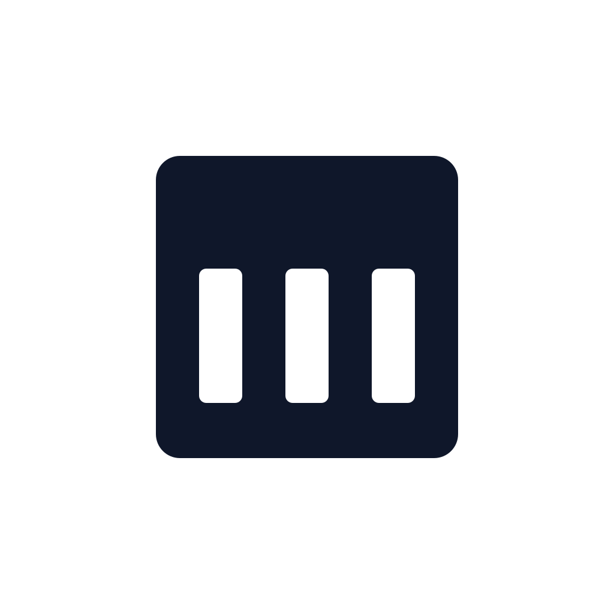
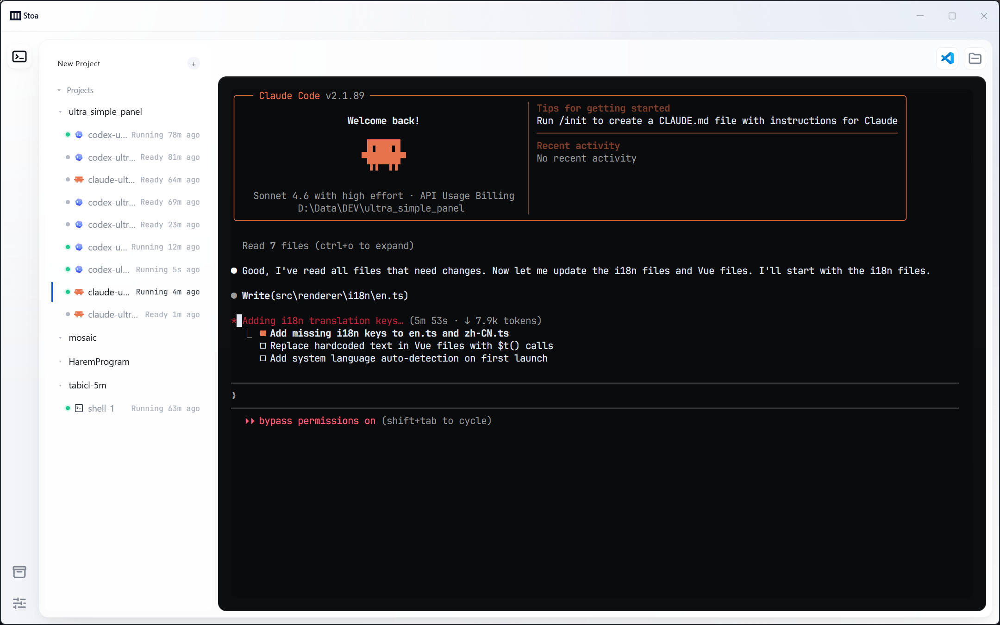
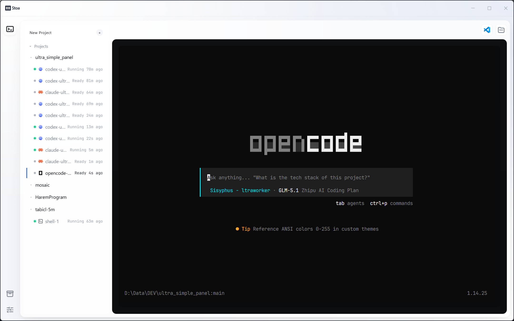

<p align="center">
  
</p>

# Stoa

[English](README.en.md)

Stoa 是一个完全开源的本地 AI 编程工作台。

它为多项目、多 Agent、多 CLI 会话提供一个简洁专注的桌面控制台，用近千个测试维护核心路径，目标是把 AI CLI 工作流从临时终端体验推进到稳定、可恢复、可长期使用的生产级体验。

## 项目截图



_在 Stoa 中运行 Claude Code，会话状态、工作区列表和终端上下文保持在同一个本地控制台里。_



_OpenCode 会话同样可以作为 provider 接入，和其他 CLI Agent 一起被统一管理。_

## 为什么使用 Stoa

### 近千个测试守护的稳定体验

Stoa 不是只展示概念的 demo。项目用单元测试、集成测试、Electron E2E、生成式 Playwright journey 和行为覆盖检查共同维护核心路径，让多会话 AI 编程工作流具备接近生产级应用的稳定性。

### 简洁专注的 UI

Stoa 不试图替代 IDE，也不堆叠复杂面板。界面围绕一个核心工作流设计：左侧管理工作区和会话状态，右侧专注终端。你可以在多个项目和多个 Agent 会话之间切换，而不让界面本身成为负担。

### 支持多个 CLI 工具

Stoa 以 provider 方式接入 AI CLI 工具，而不是绑定单一厂商或单一命令。Codex、Claude、OpenCode 等 CLI 工具都可以成为 Stoa 工作台中的会话后端。

### 完全开源，可审计、可扩展

桌面壳、状态管理、provider 接入方式、行为资产和测试体系都在仓库中开放。你可以直接审计 Stoa 如何管理会话、恢复状态、承载终端，也可以基于自己的 AI CLI 工作流扩展它。

### 本地优先的会话调度台

Stoa 是本地桌面应用，不是云端平台。它负责在本机组织项目、承载终端、管理会话状态和协调恢复流程。各 AI CLI 工具自身的联网、认证和模型访问行为仍由对应工具决定。

## Stoa 解决什么问题

- 同时管理多个项目、多个工作区和多个 AI CLI 会话。
- 切换工作区时保持终端会话运行，降低上下文丢失风险。
- 用结构化状态通道反馈 Agent 状态，而不是从终端字符流里猜测。
- 把 AI 编程会话从零散终端窗口收束到一个稳定的本地控制台。
- 为长期、多任务、并发式 AI 编程提供可恢复、可验证的工作流基础。

## 当前能做什么

- 创建、切换和管理工作区。
- 在桌面应用中承载真实 CLI 终端会话。
- 保持后台会话运行，减少切换带来的中断。
- 通过状态侧信道展示运行中、等待输入、错误、恢复等状态。
- 通过 provider 模型接入不同 AI CLI。
- 用生成式 journey、行为覆盖和 Electron E2E 测试验证关键路径。

## Coming Soon: 项目级自动进化

Stoa 的下一阶段目标是让项目本身成为可持续进化的对象。

未来的项目级自动进化功能会围绕需求理解、计划生成、实现执行、测试验证、行为资产沉淀和回归检查形成闭环。目标不是简单地让 AI 改代码，而是让每一次改动都能经过上下文理解、计划约束、自动验证和经验沉淀，让项目越用越稳定，越改越清晰。

## 快速开始

### 下载应用

从 [GitHub Releases](../../releases) 下载对应平台的安装包：

- Windows: 下载 `.exe` 安装包
- macOS: 下载 `.dmg` 或 `.zip` 安装包
- Linux: 下载 `.AppImage` 或对应发行格式

安装后启动 Stoa，即可添加工作区并创建 AI CLI 会话。

## CLI 工具要求

Stoa 负责管理工作区、会话状态和终端容器；实际 AI 能力来自你本机安装的 CLI 工具。

使用对应 provider 前，请先在本机安装并登录相关 CLI：

- Claude Code
- OpenCode
- Codex

如果 Stoa 无法自动检测到 CLI 可执行文件，可以在设置里的 Providers 页面手动配置 executable path。

## 支持平台

Stoa 基于 Electron 构建，目标支持 Windows、macOS 和 Linux。

当前开发和截图主要基于 Windows 环境；其他平台安装包会随 release 流程一起发布和验证。

## 使用方式

1. 启动 Stoa。
2. 添加或选择一个工作区。
3. 在工作区中创建 AI CLI 会话。
4. 在右侧终端中与 CLI Agent 协作。
5. 通过左侧工作区列表切换项目和会话。
6. 通过状态指示理解会话当前处于运行中、等待输入、错误或可恢复状态。

## 项目状态

Stoa 仍处于 API 和功能形态快速演进阶段；核心使用路径按生产级稳定性维护。

当前阶段所有改进默认允许 breaking change，不维护兼容迁移逻辑。仓库优先保证产品方向、架构边界、测试体系和用户体验的正确性。

## 文档导航

- [愿景与设计原则](docs/overview/vision-and-principles.md)
- [系统总体架构](docs/architecture/system-architecture.md)
- [工作区控制台交互设计](docs/product/workspace-console-ux.md)
- [仓库布局规范](docs/engineering/repository-layout.md)
- [设计语言](docs/engineering/design-language.md)
- [本地开发环境](docs/engineering/local-dev-environment.md)
- [状态存储与恢复](docs/operations/state-storage-and-recovery.md)
- [发布与更新流程](docs/operations/release-and-update-runbook.md)

## 贡献与质量门禁

项目包管理器是 pnpm。下面的质量门禁命令保留 `npm run` / `npx` 形式，是当前仓库约定的验证入口。

### 开发环境要求

- Node.js 24 或兼容版本
- pnpm 10.33.0
- 支持 Electron 的本地桌面环境

### 本地开发

```bash
pnpm install
pnpm run dev
```

### 构建

```bash
pnpm run build
```

生成式测试资产是项目行为契约的一部分。不要手动编辑 `tests/generated/` 下的文件。

提交实现变更前，先重新生成确定性的测试资产：

```bash
npm run test:generate
```

完整质量门禁：

```bash
npm run test:generate
npm run typecheck
npx vitest run
npm run test:e2e
npm run test:behavior-coverage
```

一键验证：

```bash
npm run test:all
```

如果新增用户可见行为，通常需要同步更新：

- `testing/behavior/`
- `testing/topology/`
- `testing/journeys/`

然后运行 `npm run test:generate` 重新生成 Playwright journey。

## 技术架构

Stoa 使用 Electron 作为本地桌面外壳，主进程负责真实状态与进程协调，Vue 渲染进程只做界面映射。

核心技术栈：

- Electron
- Vue 3
- Pinia
- xterm.js
- node-pty
- Express webhook server
- TypeScript
- Vitest
- Playwright

核心架构边界：

- Renderer 不直接拥有真实会话控制权。
- `node-pty` 只存在于主进程或受控后端模块。
- 终端字符流只负责给人看，不负责给系统推断状态。
- Agent 生命周期、工具调用、错误信号和会话指针优先通过结构化侧信道回传。
- provider 通过明确能力契约接入，不把单一 CLI 的行为写死到 UI 中。

## License

当前仓库尚未声明正式许可证。请在使用、分发或二次开发前确认后续补充的 `LICENSE` 文件。
